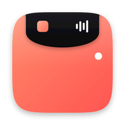

  

<h1 align="center">Dimple</h1>

  <b>화면 위 작은 보조개.</b> 
  음악 · 일정 · 볼륨과 밝기 · 파일을 Mac의 노치에서 바로.

  <a href="https://github.com/Seoiiidal/Dimple/releases/latest"><b>⬇︎ 최신 버전 받기</b></a>
  &nbsp;·&nbsp; macOS 14 이상 · Apple Silicon
  &nbsp;·&nbsp; <a href="#english">English</a>

---

## Dimple은

MacBook의 노치는 늘 그 자리에 있지만 아무 일도 하지 않아요. Dimple은 그 작은 홈을 **살아 있는 공간**으로 바꿔요.
지금 듣는 노래, 곧 시작할 회의, 충전 상태, 방금 끌어 온 파일까지 — 고개를 돌리지 않아도 노치에서 보이고, 노치에서 끝나요.
노치가 없는 Mac(외장 모니터, iMac, Mac mini, Mac Studio)에서는 화면 맨 위 가운데에 **가상 노치**가 생겨요.

## 이런 걸 할 수 있어요

**🎵 라이브 액티비티** — 노치 양옆에 지금 중요한 것만
- 재생 중인 곡과 **실제 소리에 반응하는 스펙트럼** (Apple Music · Spotify · 브라우저의 YouTube까지)
- 곧 시작하는 회의와 **원클릭 참여** (Zoom · Google Meet · Teams · Webex)
- 타이머 · 미리 알림 · 오늘 할 일 · 배터리 · 블루투스 기기 연결 · 녹음과 자막

**👀 퀵픽** — 노치에 마우스를 올리면 재생 바, 싱크 가사 한 줄, 다음 일정을 살짝

**👜 Bag** — 노치를 누르면 펼쳐지는 나만의 작업 공간
- 미디어 플레이어 · 싱크 가사(노래방 효과) · 캘린더 · 할 일 · 메모 · 타이머
- 파일 트레이 · 클립보드 기록 · 날씨 · 번역 · 실시간 자막 · 녹음 · 시스템 모니터 · 기기 배터리 · 단축어 · 거울
- 원하는 위젯만 골라 순서와 크기를 자유롭게

**🔆 볼륨 · 밝기 HUD** — macOS 기본 팝업 대신 노치에서 깔끔하게 (자동 밝기 조절 때는 조용히)

**📂 파일 드롭** — 파일을 노치로 끌면 AirDrop · 트레이 · 공유가 바로

**🎨 테마** — 블랙 · 화이트 · 반투명, 한국어 · English

## 설치

1. [Releases](https://github.com/Seoiiidal/Dimple/releases/latest)에서 `Dimple-x.y.z.dmg`를 받아 엽니다.
2. Dimple을 **Applications(응용 프로그램)** 폴더로 끌어다 놓습니다.
3. 처음 열 때 "확인되지 않은 개발자" 경고가 뜨면
   **시스템 설정 › 개인정보 보호 및 보안**에서 아래로 내려 **[그래도 열기]**를 누르세요. (Apple 공증 전이라 한 번만 필요해요)
4. 설정 › 권한 › **모든 권한 한 번에 요청**으로 필요한 권한을 켜면 끝!

> 한 번 설치하면 이후 버전은 **자동으로 업데이트**돼요. 설정과 권한도 그대로 이어져요.

## 체험판과 라이선스

- 처음 실행한 때부터 **72시간 동안 모든 기능을 무료로** 써 볼 수 있어요.
- 체험이 끝나면 노치 기능이 잠시 멈추고, **설정 › 라이선스**에서 키를 넣으면 바로 다시 켜져요.
- 라이선스 키는 개발자에게 문의해 주세요 → **seoiiidal@gmail.com**
- 키는 인터넷 없이 Mac 안에서만 확인해요.

## 개인정보

- 싱크 가사를 켜면 곡 제목 · 아티스트가 [LRCLIB](https://lrclib.net)로, 날씨 위젯은 **대략적인 위치**가 [Open-Meteo](https://open-meteo.com)로 전송돼요.
- 소리 · 알림 · 파일 · 일정 · 클립보드 내용은 **Mac 밖으로 나가지 않아요.**

## 피드백

앱이 이상하거나 바라는 기능이 있다면 메뉴 막대 아이콘 › **피드백 보내기…** 로 알려 주세요.
진단 정보와 최근 충돌 기록이 함께 첨부돼서 원인을 빠르게 찾을 수 있어요.

---

## English

**Dimple — a little dimple at the top of your screen.**
Your MacBook's notch is always there, doing nothing. Dimple turns it into a living space: the song you're playing, the meeting about to start, your battery, the file you just dragged — all visible and handled right at the notch. On Macs without a notch, a **virtual notch** appears at the top center of the screen.

**Features**
- **Live Activities** beside the notch — now playing with a real-time audio spectrum, meetings with one-click join, timer, reminders, to-dos, battery, Bluetooth devices, recording and captions
- **Quick Peek** — hover for the playback bar, the current synced lyric, or your next event
- **The Bag** — click the notch for your own workspace: media player, synced lyrics with karaoke effect, calendar, to-dos, notes, timer, file tray, clipboard history, weather, translation, live captions, recorder, system monitor, device battery, shortcuts, mirror
- **Volume & brightness HUD** in the notch instead of the system popups
- **File drop** — drag files to the notch for AirDrop · Tray · Share
- Black · White · Translucent themes, Korean · English (follows your Mac's language)

**Install**
1. Download `Dimple-x.y.z.dmg` from [Releases](https://github.com/Seoiiidal/Dimple/releases/latest) and drag Dimple into **Applications**.
2. On first launch, if you see an "unidentified developer" warning, open **System Settings › Privacy & Security**, scroll down and click **Open Anyway** (needed once, as the app isn't notarized yet).
3. Turn on permissions in Settings › Permissions › **Request All Permissions at Once**.

Later versions update automatically, keeping your settings and permissions.

**Trial & License** — Every feature is free for **72 hours** from first launch. After that, enter a license key in **Settings › License** to keep using Dimple. For a key, contact **seoiiidal@gmail.com**. Keys are verified offline on your Mac.

**Privacy** — With synced lyrics on, song title and artist go to LRCLIB; the weather widget sends an approximate location to Open-Meteo. Audio, notifications, files, events, and clipboard contents never leave your Mac.

**Requirements** — macOS 14 Sonoma or later · Apple silicon Mac

---

© 2026 Dimple · Made with care in Korea

